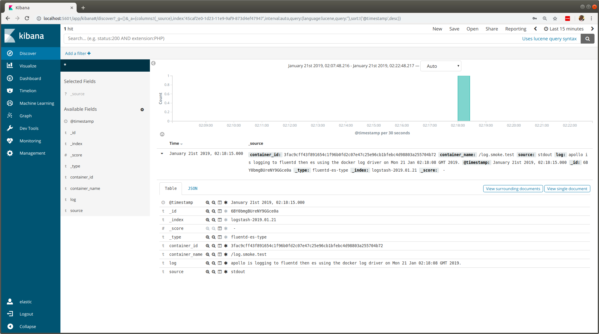

#### The primary use case involves containerized apps using a *fluentd docker log-driver* to push logs to a fluentd container that in turn forwards them to an elasticsearch instance. The secondary use case is visualizing the logs via a Kibana container linked to elasticsearch.

# Docker Logs to Fluentd and Elasticsearch

**fluentd** will pump logs from docker containers to an ***elasticsearch database***. These logs can then be viewed via a docker **kibana user interface** that reads from the elasticsearch database. With this plan you

1. run an **`elasticsearch`** docker container
1. run a **`kibana`** docker container
1. run a **`fluentd (logstash)`** docker container
1. use docker's **`fluentd log-driver`** switch to run a container
1. login to the **`kibana ui`** to visualize the logs

---

## 1 | docker run elasticsearch

```bash
docker run --detach --rm \
    --name elastic-db    \
    --publish 9200:9200  \
    --publish 9300:9300  \
    --env discovery.type=single-node \
    --env transport.host=127.0.0.1   \
    --env ELASTIC_PASSWORD=secret    \
    docker.elastic.co/elasticsearch/elasticsearch-platinum:6.0.0 && sleep 20
```

*The sleep commands give the containers breathing space before client connections are made.*

---

## 2 | docker run kibana

#### @todo - attempt setting ( --network host ) and then eradicate the elastic-db container name which is then replaceable by localhost
#### @todo - try removing the legacy link option switch if the above --network host is successful
#### @todo - try updating the versions of both elasticsearch and kibana

```bash
docker run --detach --rm \
    --name kibana-ui     \
    --publish 5601:5601  \
    --link elastic-db    \
    --env "ELASTICSEARCH_URL=http://elastic-db:9200" \
    --env ELASTICSEARCH_PASSWORD=secret              \
    docker.elastic.co/kibana/kibana:6.0.0 && sleep 20
```

---

## 3 | docker run fluentd (logstash)

The **[Dockerfile](Dockerfile)** manifest for **`devops4me/fluentd-es`** does 2 things to the log collector container. It

- installs **`fluentd's elasticsearch plugin`** *and*
- copies the **[fluentd configuration](fluentd-logs.conf)** file into it

You could build the image using **`docker build --rm --no-cache --tag fluent4me .`** or simply run it with the below ***docker run***.

```bash
docker run --interactive --tty \
    --name fluentd.logs        \
    --network host             \
    --publish 24224:24224      \
    --env FLUENTD_CONF=fluentd-logs.conf \
    fluent4me

==> or devops4me/fluentd-es
```

#### localhost in [fluentd-logs.conf](fluentd-logs.conf)

**`localhost`** in fluentd-logs.conf reaches elasticsearch because we used **`--network=host`** to run the fluentd container. Without it we would need the precise IP address or hostname for the host parameter.


---


## 4 | docker run | --log-driver fluentd

***Let's run Jenkins locally and set its log driver to a fluentd docker container that we've started locally and configured to push to the local elasticsearch container started above.***

#### --log-opt fluentd-address=localhost:24224

```bash
docker run                \
    --name log.smoke.test \
    --network host        \
    --log-driver fluentd  \
    --log-opt fluentd-address=localhost:24224 \
    ubuntu \
    echo "supercalifragilistic log to elasticsearch via fluentd on $(date)."
```

Again the **`--network host`** switch (in both) allows us to access the fluentd (logstash) log collector without stating the precise ip address or hostname.

### query doc from elasticsearch

#### `curl 'localhost:9200/_search?q=supercalifragilistic&pretty' -u 'elastic:secret'`

This query verifies that our **`supercalifragilistic`** log document is in the elasticsearch database. The response reads like this.

```json
{
  "took" : 41,
  "timed_out" : false,
  "_shards" : {
    "total" : 12,
    "successful" : 12,
    "skipped" : 0,
    "failed" : 0
  },
  "hits" : {
    "total" : 1,
    "max_score" : 0.2876821,
    "hits" : [
      {
        "_index" : "logstash-2019.01.21",
        "_type" : "fluentd-es-type",
        "_id" : "lhZgbmgBUreNY9GGjvzF",
        "_score" : 0.2876821,
        "_source" : {
          "container_id" : "356b3b051426294eb666122e66e16924af1b18b49ab262f146d77d47f1cc1c1a",
          "container_name" : "/log.smoke.test",
          "source" : "stdout",
          "log" : "supercalifragilistic log to elasticsearch via fluentd on Mon 21 Jan 03:06:25 GMT 2019.",
          "@timestamp" : "2019-01-21T03:06:25.000000000+00:00"
        }
      }
    ]
  }
}
```

---

## 5 | kibana visualize

The **smoke test in step 4** used **`docker log-driver`** to write to our fluentd container which **(after one minute due to near real time)** makes the log available in the Kibana user interface. To view the log you

- visit url **`http://localhost:5601`**
- enter username **`elastic`**
- enter password **`secret`**
- click on **`Discover`**
- find **`last 15 minutes`** at the top right
- change to **`last 7 days`**

Our **`supercalifragilistic`** log should appear.  Open it up with the little arrow or choose to view it in JSON.


### kibana screenshot of log from docker container

<!---

-->


***The screenshot shows that our smoke test log is in the elasticsearch database and accessible via the Kibana visualization user interface.***

---


<!---

## Useful Commands

```bash
curl 'localhost:9200/logstash-2019.01.21/_doc/1?pretty' -u 'elastic:secret'
curl 'localhost:9200/_search?q=apollo&pretty' -u 'elastic:secret'
curl 'localhost:9200/_search?q=jenkins&pretty' -u 'elastic:secret'
curl 'localhost:9200/logstash-2019.01.21/_mapping/group?pretty' -u 'elastic:secret'
curl 'localhost:9200/logstash-2019.01.21/_mapping/group?pretty' -u 'elastic:secret'
curl 'localhost:9200/_search?q=smoke&pretty' -u 'elastic:secret'
curl 'localhost:9200/_search?q=jenkins&pretty' -u 'elastic:secret'
curl 'localhost:9200/_cat/indices?v&pretty' -u 'elastic:secret'
```


#### `curl 'localhost:9200/_cat/indices?v&pretty' -u 'elastic:secret'`

```
health status index                           uuid                   pri rep docs.count docs.deleted store.size pri.store.size
yellow open   .triggered_watches              fK2iGqDQTWue7ZmQkT6t3A   1   1          0            0     16.2kb         16.2kb
yellow open   .monitoring-es-6-2019.01.21     t1a2c6SWQdCI9De3oufHWw   1   1       4084           24      1.9mb          1.9mb
yellow open   .watches                        qAt3cJKXTcq6o8HJUowMXw   1   1          5            0     33.4kb         33.4kb
yellow open   logstash-2019.01.21             oBk-QrcvRmi22DIOI7t77g   5   1          1            0        8kb            8kb
yellow open   .monitoring-kibana-6-2019.01.21 TpoKwbPbRTa7mix75KqxaQ   1   1        334            0      218kb          218kb
yellow open   .kibana                         3aV5WqlIQoyBMWsqmYEFJg   1   1          2            0     33.7kb         33.7kb
yellow open   .monitoring-alerts-6            0fa4o5CARvCyFdejexm4yA   1   1          1            0      6.5kb          6.5kb
yellow open   .watcher-history-6-2019.01.21   xn8EFUksTpOj0ZkDXA7dWw   1   1        406            0    562.8kb        562.8kb
```


```bash
curl "http://localhost:9200/_count" -u 'elastic:secret' && echo

curl -XPUT http://localhost:9200/sanity-check-index/movie/1  -u 'elastic:secret' -d '{"director": "Burton, Tim", "genre": ["Comedy","Sci-Fi"], "year": 1996, "actor": ["Jack Nicholson","Pierce Brosnan","Sarah Jessica Parker"], "title": "Mars Attacks!"}' -H 'Content-Type: application/json' && echo
```


```bash
curl -XPUT 'localhost:9200/get-together/group/1?pretty' -u 'elastic:secret' -d '{
"name": "Elasticsearch Denver",
"organizer": "Lee"
}' -H 'Content-Type: application/json'

curl -XPUT 'localhost:9200/get-together/group/1?pretty' -u 'elastic:secret' -d '{
"name": "Elasticsearch Denver",
"organizer": "Lee"
}' -H 'Content-Type: application/json'

curl 'localhost:9200/get-together/_mapping/group?pretty' -u 'elastic:secret'

curl 'localhost:9200/get-together/_search?q=*&pretty' -u 'elastic:secret'

curl 'localhost:9200/.monitoring-es-6-2019.01.19/_search?q=*&pretty' -u 'elastic:secret'

curl 'localhost:9200/.watcher-history-6-2019.01.19/_search?q=*&pretty' -u 'elastic:secret'
```


## ElasticSearch and S3

#### excellent information

https://www.fluentd.org/guides/recipes/elasticsearch-and-s3

https://raw.githubusercontent.com/fluent/fluentd-docker-image/master/v1.3/alpine-onbuild/fluent.conf

https://www.fluentd.org/guides/recipes/docker-logging

-->

## Appendices

### Remove all Docker Containers and Images

Wipe the docker slate clean by ***removing all containers and images*** with these commands.

```bash
docker rm -vf $(docker ps -aq)
docker rmi $(docker images -aq) --force
docker ps -a
docker images -a
```

### fluentd logs 4 [Jenkins 2.0](https://github.com/devops4me/jenkins-2.0)

Let's adapt the **[Jenkins 2.0](https://github.com/devops4me/jenkins-2.0)** container to send its logs via fluentd to an elasticsearch instance in localhost.

```bash
docker run --tty --privileged --detach \
    --network host
    --log-driver fluentd \
    --log-opt fluentd-address=localhost:24224 \
    --volume /var/run/docker.sock:/var/run/docker.sock \
    --volume /usr/bin/docker:/usr/bin/docker \
    --publish 8080:8080       \
    --name jenkins-2.0     \
    devops4me/jenkins-2.0
```
