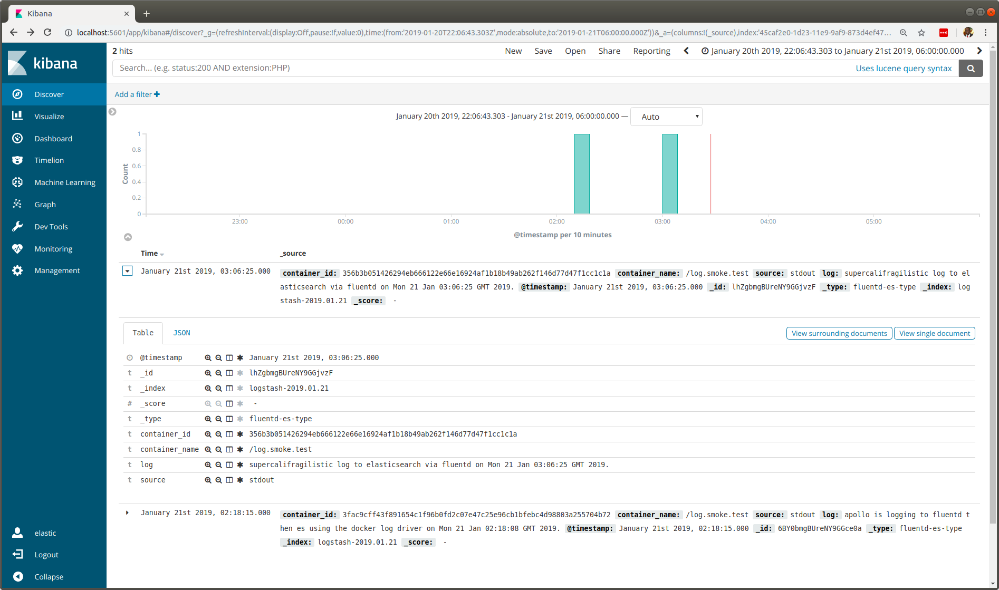

#### The primary use case involves containerized apps using a *fluentd docker log-driver* to push logs to a fluentd container that in turn forwards them to an elasticsearch instance. The secondary use case is visualizing the logs via a Kibana container linked to elasticsearch.

# Send Docker Logs to Fluentd and Elasticsearch

**fluentd** will pump logs from docker containers to an ***elasticsearch database***. These logs can then be viewed via a docker **kibana user interface** that reads from the elasticsearch database. With this plan you

1. run an **`elasticsearch`** docker container
1. run a **`kibana`** docker container
1. run a **`fluentd (logstash)`** docker container
1. use docker's **`fluentd log-driver`** switch to run a container
1. login to the **`kibana ui`** to visualize the logs

---

## 1 | docker run elasticsearch

```bash
docker run --detach --rm             \
    --name elastic-db                \
    --publish 9200:9200              \
    --publish 9300:9300              \
    --env discovery.type=single-node \
    --env transport.host=127.0.0.1   \
    --env ELASTIC_PASSWORD=secret    \
    docker.elastic.co/elasticsearch/elasticsearch-platinum:6.0.0 && sleep 20
```

*The sleep commands give the containers breathing space before client connections are made.*

---

## 2 | docker run kibana

#### @todo - attempt setting ( --network host ) and then eradicate the elastic-db container name which is then replaceable by localhost
#### @todo - try removing the legacy link option switch if the above --network host is successful
#### @todo - try updating the versions of both elasticsearch and kibana

```bash
docker run --detach --rm \
    --name kibana-ui     \
    --publish 5601:5601  \
    --link elastic-db    \
    --env "ELASTICSEARCH_URL=http://elastic-db:9200" \
    --env ELASTICSEARCH_PASSWORD=secret              \
    docker.elastic.co/kibana/kibana:6.0.0 && sleep 20
```

Use **`http://localhost:5601`** with username **`elastic`** and password **`secret`** to access Kibana.

---


## 3 | docker run fluentd (logstash)

Within the **[Dockerfile](Dockerfile)** for **`devops4me/fluentd`** every command

- **either** installs a **fluentd plugin**
- **or** it copies in a **configuration template**

Select the configuration file that suits your needs and reference it in the  **`FLUENTD_CONF`** environment variable in **`docker run`** along with other options documented in the tables below.

### fluentd to elasticsearch | http

Fluentd/logstash sends its logs to an elasticsearch instance configured with a username password.

```bash
docker run --interactive --tty                           \
    --name fluentd.es.logs                               \
    --network host                                       \
    --publish 24224:24224                                \
    --env FLUENTD_CONF=fluentd-elasticsearch-simple.conf \
    --env ELASTICSEARCH_HOSTNAME=<<hostname>             \
    --env ELASTICSEARCH_PORT=<<port>>                    \
    --env ELASTICSEARCH_USERNAME=<<username>             \
    --env ELASTICSEARCH_PASSWORD=<<password>>            \
    devops4me/fluentd
```

| Environment Variable       | Mandatory? | Fluentd Configuration Explained |
|:-------------------------- |:---------- |:------------------------------- |
| **FLUENTD_CONF** | Mandatory  | Always use **`fluentd-elasticsearch-simple.conf`** |
| **ELASTICSEARCH_HOSTNAME** | Mandatory  | Hostname, url or IP Address |
| **ELASTICSEARCH_PORT** | Mandatory  | Usually 9200 or 443 (https) and 80 for (http) |
| **ELASTICSEARCH_SCHEME** | Optional | Defaults to **`http`** but you can pass in **`https`** |
| **ELASTICSEARCH_USERNAME** | Mandatory  | Username configured in elasticsearch |
| **ELASTICSEARCH_PASSWORD** | Mandatory  | Password configured in elasticsearch |

#### simple elasticsearch| example docker run

```bash
docker run --interactive --tty                           \
    --name fluentd.simple.logs                           \
    --network host                                       \
    --publish 24224:24224                                \
    --env FLUENTD_CONF=fluentd-elasticsearch-simple.conf \
    --env ELASTICSEARCH_HOSTNAME=localhost               \
    --env ELASTICSEARCH_PORT=9200                        \
    --env ELASTICSEARCH_USERNAME=elastic                 \
    --env ELASTICSEARCH_PASSWORD=secret                  \
    devops4me/fluentd
```

This **`localhost`** reaches elasticsearch if we use **`--network=host`** to run both the fluentd container as well as the docker containers that source the logs through the log-driver.

---


### s3 with AWS credentials | fluentd logs copied to S3 and elasticsearch | https

This configuration uses AWS credentials so you can post it from your laptop. The other one uses roles so the ec2 instance would be configured to access the bucket without credentials.


#### BEWARE - the **S3_BUCKET_REGION** is against the S3 bucket **and is not the same as** **`AWS_REGION`** | **`AWS_DEFAULT_REGION`** which decide where infrastructure gets created.

To discover the S3_BUCKET_REGION you must go to the S3 bucket in the AWS console, click on it and at the top right you will see the region name. Use that to set the region ID in your fluentd docker run environment variable.

```conf
<source>
    type forward
    port 24224
    bind 0.0.0.0
</source>

<match *.*>
    @type stdout
</match>

<match **>
    @type copy

    <store>
        @type elasticsearch
        host "#{ENV['ELASTICSEARCH_HOSTNAME']}"
        port "#{ENV['ELASTICSEARCH_PORT']}"
        scheme "#{ENV['ELASTICSEARCH_SCHEME'] || 'http'}"
        logstash_format true
        logstash_prefix "#{ENV['ELASTICSEARCH_PREFIX'] || 'app.logs'}"
        type_name "#{ENV['ELASTICSEARCH_TYPE_NAME'] || 'log.msg'}"
    </store>

    <store>
        @type s3
        aws_key_id "#{ENV['S3_AWS_ACCESS_KEY']}"
        aws_sec_key "#{ENV['S3_AWS_SECRET_KEY']}"
        s3_bucket "#{ENV['S3_BUCKET_NAME']}"
        s3_region "#{ENV['S3_BUCKET_REGION']}"
        utc
	store_as "#{ENV['S3_BUCKET_FILE_TYPE'] || 'json'}"
        path logs.%Y.%m-%B/%d-%A/
        s3_object_key_format "%{path}%{time_slice}-#{Socket.gethostname}-%{index}.%{file_extension}"
        time_slice_format %Y.%m.%d-%H%M
    </store>

</match>
```
---


### fluentd logs copied to S3 and elasticsearch | https

Many production systems copy logs to both S3 and an elasticsearch kibana instance. This docker run triggers a fluentd container that knows

- which host and port elasticsearch is listening on
- which s3  bucket to send logs to
- the S3 path and object (file) name format 

There are **no IAM user credentials here** because your ec2 instances should have the correct roles to write into the S3 bucket.

```bash
docker run --interactive --tty                       \
    --name fluentd.s3.es.logs                        \
    --publish 24224:24224                            \
    --env FLUENTD_CONF=fluentd-elasticsearch-s3.conf \
    --env ELASTICSEARCH_HOSTNAME=<<hostname>         \
    --env ELASTICSEARCH_PORT=<<port>>                \
    --env ELASTICSEARCH_SCHEME=<<scheme>             \
    --env S3_BUCKET_NAME=<<s3-bucket-name>>          \
    --env S3_BUCKET_REGION=<<aws-region>>            \
    devops4me/fluentd
```

### fluentd-elasticsearch-s3.conf

With this config fluentd pushes out logs to **an elasticsearch instance** and **an AWS S3 bucket**.

| Environment Variable       | Mandatory? | Fluentd Configuration Explained |
|:-------------------------- |:---------- |:------------------------------- |
| **FLUENTD_CONF** | Mandatory  | Always use **`fluentd-elasticsearch-s3.conf`** |
| **ELASTICSEARCH_HOSTNAME** | Mandatory  | Hostname, url or IP Address |
| **ELASTICSEARCH_PORT** | Mandatory  | Usually 9200 or 443 (https) and 80 for (http) |
| **ELASTICSEARCH_SCHEME** | Optional | Defaults to **`http`** but you can pass in **`https`** |
| **ELASTICSEARCH_PREFIX** | Optional | elasticsearch document index name will be prefixed with this. |
| **ELASTICSEARCH_TYPE_NAME** | Optional | elasticsearch document type name. |
| **S3_BUCKET_NAME** | Mandatory | The name of the S3 bucket to copy logs to. |
| **S3_BUCKET_REGION** | Mandatory | The AWS region the bucket is in. |
| **S3_BUCKET_FILE_TYPE** | Optional | Default is json but you can also have gzip and txt. |


#### s3 and elasticsearch| example docker run

```bash
docker run --interactive --tty                       \
    --name fluentd.s3.es.logs                        \
    --network host                                   \
    --publish 24224:24224                            \
    --env FLUENTD_CONF=fluentd-elasticsearch-s3.conf \
    --env ELASTICSEARCH_HOSTNAME=<<es-hostname>>     \
    --env ELASTICSEARCH_PORT=443                     \
    --env ELASTICSEARCH_SCHEME=https                 \
    --env S3_BUCKET_NAME=<<s3-bucket-name>>          \
    --env S3_BUCKET_REGION=<<aws-region>>            \
    devops4me/fluentd
```


---


## 4 | docker run --log-driver fluentd

You append **`--log-driver fluentd`** and **`--log-opt fluentd-address=localhost:24224`** to the docker run of any container you wish to collect logs from. Docker will then push its stdout logs to our on-board fluentd / logstash collector.

```bash
docker run                \
    --name log.smoke.test \
    --log-driver fluentd  \
    --log-opt fluentd-address=localhost:24224 \
    ubuntu \
    echo "supercalifragilistic log to elasticsearch via fluentd on $(date)."
```

Again the **`--network host`** switch (in both) allows us to access the fluentd (logstash) log collector without stating the precise ip address or hostname.

### query doc from elasticsearch

#### `curl 'localhost:9200/_search?q=supercalifragilistic&pretty' -u 'elastic:secret'`

This query verifies that our **`supercalifragilistic`** log document is in the elasticsearch database. The response reads like this.

```json
{
  "took" : 41,
  "timed_out" : false,
  "_shards" : {
    "total" : 12,
    "successful" : 12,
    "skipped" : 0,
    "failed" : 0
  },
  "hits" : {
    "total" : 1,
    "max_score" : 0.2876821,
    "hits" : [
      {
        "_index" : "logstash-2019.01.21",
        "_type" : "fluentd-es-type",
        "_id" : "lhZgbmgBUreNY9GGjvzF",
        "_score" : 0.2876821,
        "_source" : {
          "container_id" : "356b3b051426294eb666122e66e16924af1b18b49ab262f146d77d47f1cc1c1a",
          "container_name" : "/log.smoke.test",
          "source" : "stdout",
          "log" : "supercalifragilistic log to elasticsearch via fluentd on Mon 21 Jan 03:06:25 GMT 2019.",
          "@timestamp" : "2019-01-21T03:06:25.000000000+00:00"
        }
      }
    ]
  }
}
```

---

## 5 | kibana visualize

The **smoke test in step 4** used **`docker log-driver`** to write to our fluentd container which **(after one minute due to near real time)** makes the log available in the Kibana user interface. To view the log you

- visit url **`http://localhost:5601`**
- enter username **`elastic`**
- enter password **`secret`**
- click on **`Discover`**
- create a **`logstash-* index pattern`**
- find **`last 15 minutes`** at the top right
- change to **`last 7 days`**

The very first time we need to create an index pattern. The fluentd container always sends data with indices beginning with **`logstash-`** and ending in a date. Set the time field to **`@timestamp`**. Once created set the index pattern as the default and select an appropriate time range.

Our **`supercalifragilistic`** log should appear.  Open it up with the little arrow or choose to view it in JSON.


### kibana screenshot of log from docker container

<!---

-->


***The screenshot shows that our smoke test log is in the elasticsearch database and accessible via the Kibana visualization user interface.***

---


<!---

## Useful Commands

```bash
curl 'localhost:9200/logstash-2019.01.21/_doc/1?pretty' -u 'elastic:secret'
curl 'localhost:9200/_search?q=apollo&pretty' -u 'elastic:secret'
curl 'localhost:9200/_search?q=jenkins&pretty' -u 'elastic:secret'
curl 'localhost:9200/logstash-2019.01.21/_mapping/group?pretty' -u 'elastic:secret'
curl 'localhost:9200/logstash-2019.01.21/_mapping/group?pretty' -u 'elastic:secret'
curl 'localhost:9200/_search?q=smoke&pretty' -u 'elastic:secret'
curl 'localhost:9200/_search?q=jenkins&pretty' -u 'elastic:secret'
curl 'localhost:9200/_cat/indices?v&pretty' -u 'elastic:secret'
```


#### `curl 'localhost:9200/_cat/indices?v&pretty' -u 'elastic:secret'`

```
health status index                           uuid                   pri rep docs.count docs.deleted store.size pri.store.size
yellow open   .triggered_watches              fK2iGqDQTWue7ZmQkT6t3A   1   1          0            0     16.2kb         16.2kb
yellow open   .monitoring-es-6-2019.01.21     t1a2c6SWQdCI9De3oufHWw   1   1       4084           24      1.9mb          1.9mb
yellow open   .watches                        qAt3cJKXTcq6o8HJUowMXw   1   1          5            0     33.4kb         33.4kb
yellow open   logstash-2019.01.21             oBk-QrcvRmi22DIOI7t77g   5   1          1            0        8kb            8kb
yellow open   .monitoring-kibana-6-2019.01.21 TpoKwbPbRTa7mix75KqxaQ   1   1        334            0      218kb          218kb
yellow open   .kibana                         3aV5WqlIQoyBMWsqmYEFJg   1   1          2            0     33.7kb         33.7kb
yellow open   .monitoring-alerts-6            0fa4o5CARvCyFdejexm4yA   1   1          1            0      6.5kb          6.5kb
yellow open   .watcher-history-6-2019.01.21   xn8EFUksTpOj0ZkDXA7dWw   1   1        406            0    562.8kb        562.8kb
```


```bash
curl "http://localhost:9200/_count" -u 'elastic:secret' && echo
```


```bash
curl -XPUT 'localhost:9200/get-together/group/1?pretty' -u 'elastic:secret' -d '{
"name": "Elasticsearch Denver",
"organizer": "Lee"
}' -H 'Content-Type: application/json'

curl -XPUT 'localhost:9200/get-together/group/1?pretty' -u 'elastic:secret' -d '{
"name": "Elasticsearch Denver",
"organizer": "Lee"
}' -H 'Content-Type: application/json'

curl 'localhost:9200/get-together/_mapping/group?pretty' -u 'elastic:secret'

curl 'localhost:9200/get-together/_search?q=*&pretty' -u 'elastic:secret'

curl 'localhost:9200/.monitoring-es-6-2019.01.19/_search?q=*&pretty' -u 'elastic:secret'

curl 'localhost:9200/.watcher-history-6-2019.01.19/_search?q=*&pretty' -u 'elastic:secret'
```


## ElasticSearch and S3

#### excellent information

https://www.fluentd.org/guides/recipes/elasticsearch-and-s3

https://raw.githubusercontent.com/fluent/fluentd-docker-image/master/v1.3/alpine-onbuild/fluent.conf

https://www.fluentd.org/guides/recipes/docker-logging

-->


## Appendices


### A - Count Documents in ElasticSearch

Count the number of documents in the elasticsearch database. Choose the command below and substitute the url and username / password if necessary.

```bash
curl "http://<<elasticsearch-url>>/_count?pretty"
curl "http://<<elasticsearch-url>>/_count?pretty" -u '<<username>>:<<password>>'
curl "http://localhost:9200/_count?pretty" -u '<<username>>:<<password>>'
```

### B - Put Documents into ElasticSearch

Choose the command below and substitute url and username password if necessary.


#### Put Without Username / Password

```bash
curl -XPUT http://<<elasticsearch-url>>/film-index/film/1 -d \
'{
"director": "Burton, Tim",
"genre": ["Comedy","Sci-Fi"],
"year": 1996,
"actor": ["Jack Nicholson","Pierce Brosnan","Sarah Jessica Parker"],
"title": "Apollo 13"
}' \
-H 'Content-Type: application/json' | jq .

curl -XPUT http://<<elasticsearch-url>>/song-index/song/1 -d \
'{
"director": "Michael Jackson",
"genre": ["Comedy","Sci-Fi"],
"year": 2001,
"actor": ["Jack Nicholson","Pierce Brosnan","Sarah Jessica Parker"],
"title": "Billi Jean"
}' \
-H 'Content-Type: application/json' | jq .
```

#### Put With Username / Password

```bash
curl -XPUT http://<<elasticsearch-url>>/song-index/song/1 -u '<<username>>:<<password>>' -d \
'{
"director": "Michael Jackson",
"genre": ["Comedy","Sci-Fi"],
"year": 2001,
"actor": ["Jack Nicholson","Pierce Brosnan","Sarah Jessica Parker"],
"title": "Billi Jean"
}' \
-H 'Content-Type: application/json' | jq .
```


### C - send [jenkins](https://github.com/devops4me/jenkins-2.0) logs to fluentd

Let's adapt the **[Jenkins 2.0](https://github.com/devops4me/jenkins-2.0)** container to send its logs via fluentd to an elasticsearch instance in localhost.

```bash
docker run --tty --privileged --detach                 \
    --network host                                     \
    --log-driver fluentd                               \
    --log-opt fluentd-address=localhost:24224          \
    --volume /var/run/docker.sock:/var/run/docker.sock \
    --volume /usr/bin/docker:/usr/bin/docker           \
    --publish 8080:8080                                \
    --name jenkins-2.0                                 \
    devops4me/jenkins-2.0
```

### D - fluentd | docker build | docker push

This example employs the **`safe credentials manager`** for keeping dockerhub credentials safe.

```bash
cd /path/to/fluentd/project
docker build --rm --no-cache --tag devops4me/fluentd .
safe open dockerhub devops4me
safe docker login
docker push devops4me/fluentd
docker tag devops4me/fluentd devops4me/fluentd:v0.1.0001
docker push devops4me/fluentd:v0.1.0001
safe docker logout
```

### E - Remove all Docker Containers and Images

Wipe the docker slate clean by ***removing all containers and images*** with these commands.

```bash
docker rm -vf $(docker ps -aq)
docker rmi $(docker images -aq) --force
docker ps -a
docker images -a
```

### F - Documentation for the S3 Plugin

https://www.elastic.co/guide/en/logstash/current/plugins-outputs-s3.html
